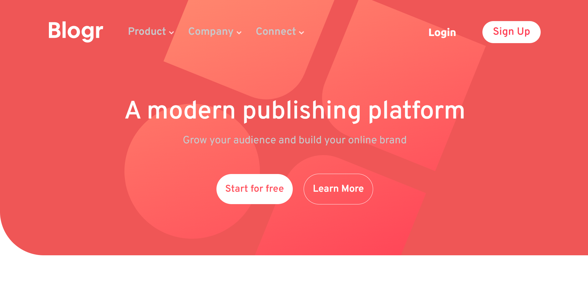

# Frontend Mentor - Blogr landing page solution

This is a solution to the [Blogr landing page challenge on Frontend Mentor](https://www.frontendmentor.io/challenges/blogr-landing-page-EX2RLAApP). Frontend Mentor challenges help you improve your coding skills by building realistic projects. 

### Link

- Live Site URL: [portfolio link](https://wizzy-design.github.io/wisdom_portfolio/)

### Screenshot

## My process

### Built with

- Semantic HTML5 markup
- CSS custom properties
- Flexbox
- Mobile-first workflow

## Author

- Website - [Wisdom Ochei](https://wizzy-design.github.io/wisdom_portfolio/)
- Twitter - [@WisdomOchei](https://www.twitter.com/WisdomOchei)
